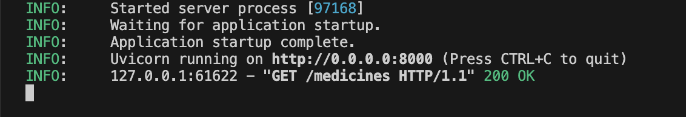
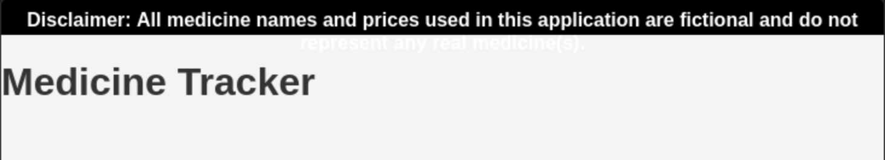
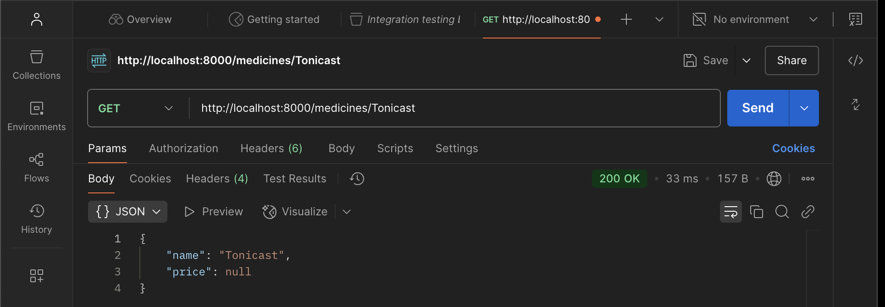
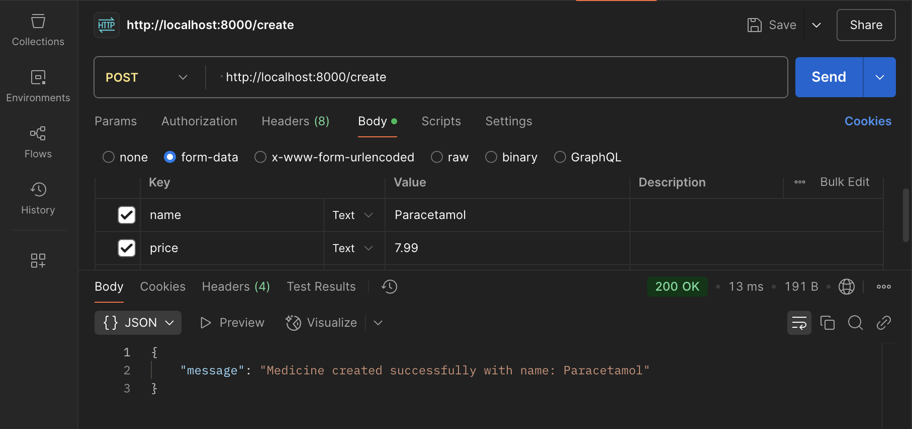
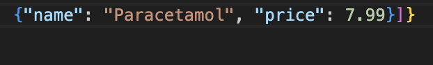
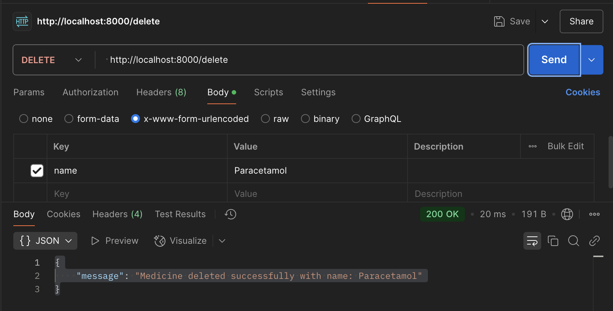

# Project Overview

## Project Name: Healthcare Web Application

### Purpose:
This project is designed to enhance healthcare service delivery by creating an efficient web application for healthcare providers. It allows users to manage patient data, appointments, and feedback, aiming to improve both healthcare accessibility and administrative efficiency.

## Approach and Strategy for Tackling the Challenge

To begin, I verified that the necessary tools, such as Python and Git, were installed on my machine. I confirmed their versions using the following commands:

```bash
python --version
git --version


These commands confirmed the installed versions. After confirming the prerequisites, I created a detailed to-do list to organize the tasks, ensuring nothing was missed during the implementation process.

Next, I cloned the project from GitHub, as outlined in the project README. I then reviewed the project structure, examining each package within the project directory. According to the README, it was necessary to determine the appropriate environment for running the server. Since I am working on macOS, I opted to run the server with the provided Bash script that is compatible with my system.

I carefully reviewed the Bash script, which contains the necessary commands to initialize dependencies and start the server.

Following this, I created a GitHub repository and linked it to the cloned project repository. This ensured that the initial setup was committed to my remote repository before I began any further development.

Once the initial changes were committed to Git with a suitable commit message, I proceeded with setting up the backend environment. This process included making the `start.sh` script executable with the following command:


chmod +x start.sh


I then executed it using:


./start.sh


Once the backend server was up and running, I proceeded to test the API endpoints developed in Python using Postman.

### The key API endpoints include:

- `/patients` - Retrieve all patient records.
- `/patient/{id}` - Retrieve a specific patient by ID.
- `/create` - Add a new patient record.
- `/update` - Modify existing patient details.
- `/delete` - Remove a patient record.

Each endpoint was tested using Postman to ensure that it was working correctly. For instance, the `/create` endpoint was tested by submitting data for a new patient, while the `/update` endpoint allowed me to modify existing data.

## Frontend Development

Once the backend was functional, I shifted focus to the frontend. I worked with HTML, CSS, and JavaScript to design an intuitive user interface that connects seamlessly with the backend. Using React, I handled data fetching and state management, ensuring that all user interactions, such as adding, updating, and deleting patient records, were reflected immediately in the UI.

I also focused on making the interface responsive and easy to use, ensuring a good experience on both desktop and mobile devices. Throughout this process, I consulted design principles and UI guidelines, which helped me create a user-friendly layout.

## Testing and Challenges

Testing was a significant part of the project. I used Postman to test each API endpoint, ensuring that requests and responses were handled correctly. I also tested the frontend extensively to ensure smooth integration with the backend.

### 1. Test: Retrieve All Medicines

To validate the `/medicine` endpoint, a GET request was executed using Postman. The request successfully returned a status code of 200 and included a JSON body containing the details of all medicines.




### 2. Test: Frontend Verification

The frontend functionality was verified by opening the `index.html` file in a web browser. The user interface displayed a header titled "Medicine Tracker," confirming the frontend was operational.



### 3. Test: Retrieve Medicine by Name

The `/medicine/{name}` endpoint was tested by sending a GET request for a specific medicine named *Tonicast*. The response returned a status code of 200, including the requested medicine details. This endpoint was further tested with another medicine, *Cureallium*, to ensure consistent functionality.




### 4. Test: Create a New Medicine

The `/create` endpoint was tested by sending a POST request via Postman, including the new medicine's name and price in the form-data. The response confirmed successful creation with a status code of 200.






### 5. Test: Update Medicine Details

A POST request was crafted to update the price of the medicine *Paracetamol*. Since the name serves as a unique identifier, only the price was modified, updated from 7.99 to 10.99. The response confirmed success with a status code of 200.

![alt text] (assets/8.png)

### 6. Test: Delete a Medicine

The `/delete` endpoint was tested by sending a DELETE request. The response returned a success message and a status code of 200, indicating the medicine was deleted correctly.



## Did you utilize any external resources?

Yes, I utilized Git for version control but faced some errors during the initial setup. I encountered issues when syncing with the remote repository, which required troubleshooting to ensure the proper commit history and clean code. Additionally, I referred to Python documentation, especially regarding API endpoint creation, and consulted various online tutorials for best practices in API testing and error handling. Postman was essential for verifying each endpoint’s response and ensuring accurate functionality.

## Objectives - Innovative Solutions

### Streamlining Data Flow: Fetching and Displaying Backend Data in a User-Friendly Frontend

**Tools:** Axios for data fetching.  
**Steps:**

1. **Data Retrieval:**
   - On DOM load, `fetchMedicines()` retrieves data from `http://localhost:8000/medicines` and stores the medicine details in `allMedicines` for local use.

2. **Display:**
   - `displayAllMedicines()` is responsible for the initial rendering. It displays each medicine's name, formatted price, and management options.

3. **Create Operation:**
   - When a user submits the form, the form data is packaged into `FormData`. A POST request is sent to `http://localhost:8000/create`. Upon success, a confirmation message is shown, the form resets, and the medicine list is refreshed.

4. **Search/Filter:**
   - Real-time filtering is implemented through the `filterMedicines()` function, which filters data based on the user’s input.

5. **Update Operation:**
   - When a user updates the price of a medicine, the new data is sent via POST to `http://localhost:8000/update`. On success, a confirmation message appears and the list is refreshed.

6. **Delete Operation:**
   - If a user deletes a medicine, a DELETE request is sent to `http://localhost:8000/delete`. On success, a message confirms the deletion, and the list is refreshed.