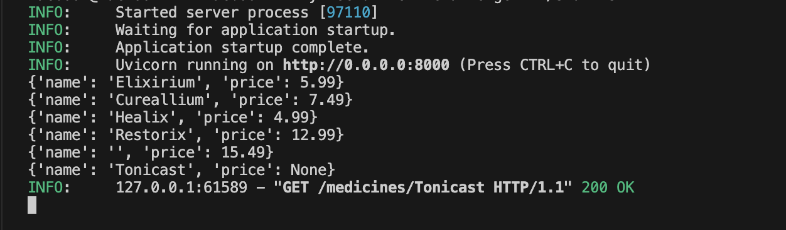

# Project Overview

## Project Name: Healthcare Web Application

### Purpose:
The Medicine Tracker project is designed to simplify the management of medicine inventories by offering a comprehensive solution for tracking medications. Its goal is to make the processes of adding, updating, retrieving, and deleting medicine records more efficient, ultimately improving inventory management for pharmacies and healthcare providers.

## Approach and Strategy for Tackling the Challenge

To begin, I verified that the necessary tools, such as Python and Git, were installed on my machine. I confirmed their versions using the following commands:

```sh
python --version
git --version


These commands confirmed the installed versions. After confirming the prerequisites, I created a detailed to-do list to organize the tasks, ensuring nothing was missed during the implementation process.

Next, I cloned the project from GitHub, as outlined in the project README. I then reviewed the project structure, examining each package within the project directory. According to the README, it was necessary to determine the appropriate environment for running the server. Since I am working on macOS, I opted to run the server with the provided Bash script that is compatible with my system.

I carefully reviewed the Bash script, which contains the necessary commands to initialize dependencies and start the server.

Following this, I created a GitHub repository and linked it to the cloned project repository. This ensured that the initial setup was committed to my remote repository before I began any further development.

Once the initial changes were committed to Git with a suitable commit message, I proceeded with setting up the backend environment. This process included making the `start.sh` script executable with the following command:

chmod +x start.sh

I then executed it using:

./start.sh


Once the backend server was up and running, I proceeded to test the API endpoints developed in Python using Postman.

### The key API endpoints include:

- `/patients` - Retrieve all patient records.
- `/patient/{id}` - Retrieve a specific patient by ID.
- `/create` - Add a new patient record.
- `/update` - Modify existing patient details.
- `/delete` - Remove a patient record.

Each endpoint was tested using Postman to ensure that it was working correctly. For instance, the /create endpoint was tested by submitting data for a new patient, while the /update endpoint allowed me to modify existing data.

## Testing and Challenges

Testing was a significant part of the project. I used Postman to test each API endpoint, ensuring that requests and responses were handled correctly. I also tested the frontend extensively to ensure smooth integration with the backend.

### 1. Test: Retrieve All Medicines

To validate the `/medicine` endpoint, a GET request was executed using Postman. The request successfully returned a status code of 200 and included a JSON body containing the details of all medicines.

### 2. Test: Frontend Verification

The frontend functionality was verified by opening the `index.html` file in a web browser. The user interface displayed a header titled "Medicine Tracker," confirming the frontend was operational.

### 3. Test: Retrieve Medicine by Name

The `/medicine/{name}` endpoint was tested by sending a GET request for a specific medicine named *Tonicast*. The response returned a status code of 200, including the requested medicine details. This endpoint was further tested with another medicine, *Cureallium*, to ensure consistent functionality.



### 4. Test: Create a New Medicine

The `/create` endpoint was tested by sending a POST request via Postman, including the new medicine's name and price in the form-data. The response confirmed successful creation with a status code of 200.


### 5. Test: Update Medicine Details

A POST request was crafted to update the price of the medicine *Paracetamol*. Since the name serves as a unique identifier, only the price was modified, updated from 7.99 to 10.99. The response confirmed success with a status code of 200.

![alt text] (assets/8.png)

### 6. Test: Delete a Medicine

The `/delete` endpoint was tested by sending a DELETE request. The response returned a success message and a status code of 200, indicating the medicine was deleted correctly.


## Did you utilize any external resources?

Yes, I utilized Postman extensively throughout the development process to validate API functionality. This tool proved essential for testing requests and analyzing response data, allowing me to confirm each endpoint's behavior matched expectations. Additionally, I referred to Python documentation, especially regarding API endpoint creation, and consulted various online tutorials for best practices in API testing and error handling. Postman was essential for verifying each endpoint’s response and ensuring accurate functionality.

## Objectives - Innovative Solutions

### Streamlining Data Flow: Fetching and Displaying Backend Data in a User-Friendly Frontend

**Tools:** Axios for data fetching.  
**Steps:**

1. **Data Retrieval:**
   - On DOM load, `fetchMedicines()` retrieves data from `http://localhost:8000/medicines` and stores the medicine details in `allMedicines` for local use.

2. **Display:**
   - `displayAllMedicines()` is responsible for the initial rendering. It displays each medicine's name, formatted price, and management options.

3. **Create Operation:**
   - When a user submits the form, the form data is packaged into `FormData`. A POST request is sent to `http://localhost:8000/create`. Upon success, a confirmation message is shown, the form resets, and the medicine list is refreshed.

4. **Search/Filter:**
   - Real-time filtering is implemented through the `filterMedicines()` function, which filters data based on the user’s input.

5. **Update Operation:**
   - When a user updates the price of a medicine, the new data is sent via POST to `http://localhost:8000/update`. On success, a confirmation message appears and the list is refreshed.

6. **Delete Operation:**
   - If a user deletes a medicine, a DELETE request is sent to `http://localhost:8000/delete`. On success, a message confirms the deletion, and the list is refreshed.


   ## Creating an Intuitive User Interface with Effective Data Management Integration

   Drawing from my previous work on healthcare management systems developed in Java, I transferred key concepts to this project, specifically focusing on pharmaceutical aspects. While pharmacy functionality was new territory for me, I quickly recognized the critical nature of robust CRUD operations. My primary objective was to develop an accessible interface that facilitates smooth data entry and backend interactions. I implemented a component-based architecture that separated the main dashboard from inventory control features, which significantly improved both system maintainability and overall user navigation.

   Transitioning to a new programming language while incorporating API functionality expanded my technical capabilities and informed my approach to creating a system that balances efficiency with accessibility. The modular structure enables users to navigate between different sections effortlessly, making data management straightforward even for those with limited technical knowledge.

   In summary, my prior development experience provided a foundation for creating a comprehensive solution that prioritizes both technical performance and user accessibility, ensuring efficient data processing alongside an approachable interface.


   ## Implementing Quarterly Medicine Price Analysis Functionality

   Although I initially had reservations about working with Python due to limited experience, my background in Java provided helpful transferable concepts for developing this feature. I established a dedicated endpoint (@app.get("/average-price")) designed to compute and return the mean price across all pharmaceutical products.

   I integrated this endpoint with the frontend to display the calculated average prominently on a dashboard card, giving users immediate access to this valuable metric.

   This implementation effectively fulfills the quarterly reporting requirements while enhancing the user experience through real-time data presentation.

   ## Challenges Encountered 

   My most significant obstacle was navigating Git version control with multiple accounts, which complicated the repository management process. I inadvertently cloned to an incorrect repository branch, creating confusion when attempting to track and commit changes. I had to consult various online resources to better comprehend terminal commands for proper project pushing, branch management, and ensuring changes were correctly committed and saved.
   
   This version control aspect proved to be the most challenging component of the project.

   Additionally, I encountered issues while testing the API through Postman, particularly with operations not properly interacting with the data.json file. After methodically debugging each step, I discovered I was structuring the request body incorrectly in Postman, specifically using improper key-value pairs when attempting to add or modify entries.
   
   Once I corrected the request format, the API operations began functioning as expected.

   ##  Evaluation
   The assignment proved to be a valuable learning opportunity for me. I found certain aspects like establishing the API structure and implementing basic endpoints relatively straightforward, while ensuring proper data persistence across operations and developing a polished frontend interface presented more substantial challenges.

   Though I initially struggled with adapting to a different programming language environment, I demonstrated increasing proficiency as the project progressed. I'm particularly satisfied with my adaptability and eagerness to investigate additional libraries to enhance functionality. My determination to overcome obstacles, especially those related to version control and request formatting, reflects my growth as a developer throughout this process. 
   
   The experience has significantly strengthened both my technical capabilities and problem-solving approach.


   If I were to undertake this project again, I would focus more on version control planning from the outset to avoid the repository complications I encountered. I would invest time upfront to properly configure my Git environment to handle multiple accounts smoothly, eliminating those frustrating push and clone issues that consumed valuable development time. 
   
   For future improvements, I would enhance the application with more comprehensive API error handling and validation in the backend to prevent incorrect data submissions before they reach the data.json file.
   
   I would also develop a more intuitive user interface with clear visual hierarchies using consistent spacing and color contrasts to guide user attention through the application flow. Adding interactive feedback such as loading indicators during API calls and clear success/error messages after operations would keep users better informed about system status. 
   
   Ensuring the application functions seamlessly across various device sizes by implementing proper media queries and flexible layouts would improve accessibility. Finally, enhancing the search functionality with appropriate "No results found" states and real-time filtering would provide users with immediate feedback, addressing the specific challenges I faced while creating a more polished and professional application that could scale effectively for future enhancements.